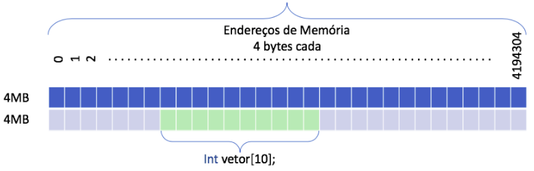
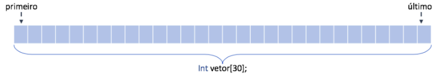

<h1 align="justify">
Listas Lineares: Implementação em C
</h1>

 
 
 
 

 

 

Das estruturas tratadas em algoritmos e estruturas de dados I, o tipo lista é a mais flexível. Nela não há regras de inserção e remoção, o que justifica iniciarmos por ela nossa compreensão de tipos abstratos de dados. 

Primeiramente, vamos pensar o que essa estrutura (i.e., modelo estático baseado em vetores) faz em nosso computador assim que é criada. Para exemplificar, observe a imagem abaixo e imagine ela como a memória de nosso computador. Um computador modesto, com dois pentes de memória RAM, cada um com 4MB.

 

Quando entramos em nosso programa com a instrução int vetor[10], o que o computador faz é criar 10 posições sequenciais na memória RAM e fazer nossa variável vetor apontar para a primeira delas. Assim, se quisermos imprimir a terceira posição desse vetor podemos realizar essa operação de duas formas:

1. printf("Valor: %d", vetor[2]) : Modelo tradicional de execução, no qual a posição é utilizada; 

2. printf("Valor: %d", *(vetor+2)) : Modelo onde utilizamos a manipulação do ponteiro ao contrário da posição.

O que queremos mostrar com isso é simples: Um vetor em C/C++ é um ponteiro nato da linguagem e as posições que ele ocupa na memória são sequenciais, uma vez que a soma de seu endereço mais duas posições nos deixa apontando para o terceiro elemento do conjunto em RAM.

>*Porque a manipulação do ponteiro funciona como índice?* 
> - Como temos um vetor de inteiros, ele tem 4 bytes por posição (espaço ocupado por um int na RAM), quando somamos 2, isso não quer dizer apenas +2. Pelo contrário, ele está somando mais duas unidades de inteiros, ou seja, +8 bytes no endereço, o que o deixa exatamente na posição sequencial correta em RAM.
>
>*Porque foi apresentado isso?* 
>Para demonstrar que vetores são sequenciais e que há necessidade de espaço sequencial em RAM para que sejam alocados. Essa é a limitação das estruturas chamadas de estática, como as tratadas nesse módulo. 

Sem mais delongas, vamos ao que nos interessa. Vamos imaginar uma estrutura do tipo lista estática. O que precisamos então criar é simplesmente um vetor de **N** posições. Feita a criação, precisamos modelar um método / função para inserir dados nesse vetor, uma função para pesquisar, uma função para remover, e assim por diante. A nossa lista deve parecer com a figura abaixo:

 
